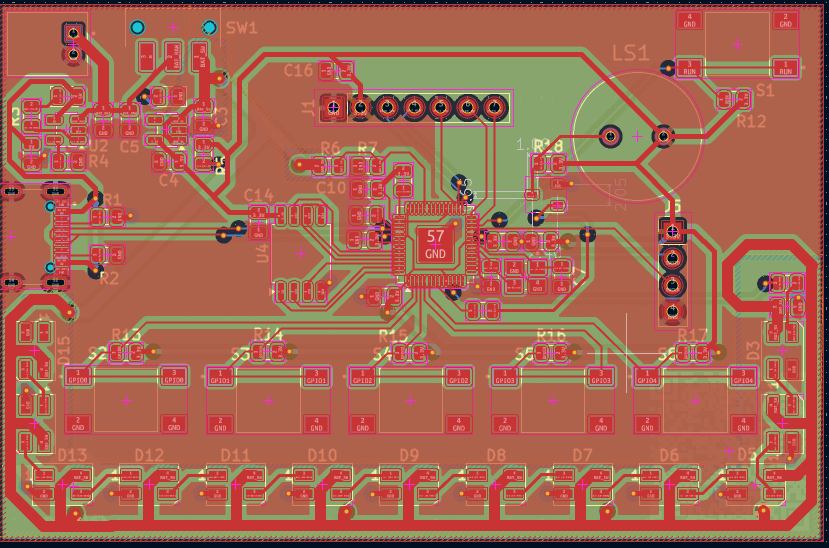

# NeonCore

  

## RP2040 Cyberpunk Development Badge

NeonCore is a cyberpunk-inspired electronic badge built around the RP2040 microcontroller. The project combines embedded hardware with custom PCB artwork, resulting in a compact development badge that is both functional and visually distinctive.

Designed entirely in KiCad, the board includes USB Type-C connectivity, Li-Po battery support with onboard charging, RGB lighting, OLED display support, external QSPI flash memory, and onboard power management. The goal was to create a portable embedded platform that could later be extended with custom firmware and interactive applications.

---

## Features

- RP2040 Dual-Core Microcontroller
- USB Type-C Connectivity
- 3.7V Li-Po Battery Support
- MCP73831 Battery Charging Circuit
- ME6211 3.3V Voltage Regulator
- 16 × SK6812 Mini RGB LEDs
- 1.3" OLED Display Support
- External QSPI Flash Memory
- Onboard Power Switch
- Custom Cyberpunk PCB Artwork

---
## Project Status

- Schematic Completed
- PCB Layout Completed
- Design Rule Check (DRC) Passed
- Gerber Files Generated
- Ready for Fabrication

---

## Tools Used

- KiCad
- Git
- GitHub

---

Designed and developed using KiCad.

